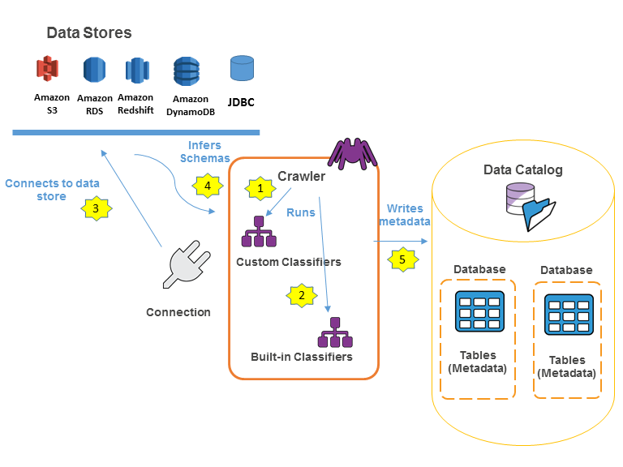

## What is AWS GLUE?

Preparing data to obtain quality results is the first step in an analytics or ML project. 
AWS Glue is a serverless data integration service that makes it easier to discover, prepare, move, 
and integrate data from multiple sources for analytics, machine learning (ML), and application development. 

You can discover and connect to over 70 diverse data sources, manage your data in a centralized data catalog, 
and visually create, run, and monitor ETL pipelines to load data into your data lakes.

## AWS GLUE Data catalog:

Databases are used to organize metadata tables in the AWS Glue. When a table is defined in the AWS Glue Data Catalog, it is added to a database.
Databases can contain tables that define data from many different data stores. This data can include objects in Amazon Simple Storage Service (Amazon S3) and relational tables in Amazon Relational Database Service.

The AWS Glue Data Catalog contains references to data that is used as sources and targets of extract, transform, and load (ETL) jobs in AWS Glue. It is an index to the location, schema, and runtime metrics of user data, wherein the information in the Data Catalog is used to create and monitor ETL jobs. This information is stored as metadata tables, where each table specifies a single data store. 
Typically, a crawler is used to take inventory of the data in data stores, but there are other ways to add metadata tables into Data Catalog.

## AWS Crawler:

Crawlers are needed to analyze data in specified s3 location and generate/update Glue Data Cataloga. In other words it persists information
about physical location of data, its schema, format and partitions which makes it possible to query actual data or to load it in Glue jobs.

Following architecture shows how GLUE Data catalog and crawler interact as part of the GLUE job

*Sources:*  
https://docs.aws.amazon.com/glue/latest/dg/catalog-and-crawler.html  
https://stackoverflow.com/questions/53608650/what-does-an-aws-glue-crawler-do
