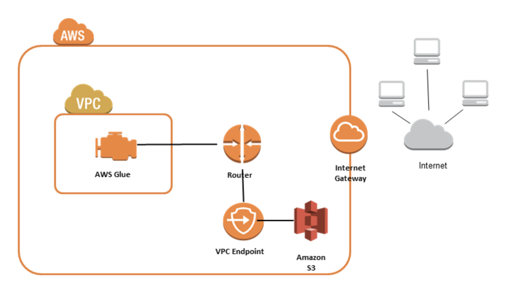

## What is Amazon VPC?

Amazon Virtual Private Cloud (VPC) is a service that lets you launch AWS resources in a logically isolated virtual network that you define. As one of AWS's foundational services, Amazon VPC makes it easy to customize your VPC's network configuration. You can create a public-facing subnet for your web servers that have access to the internet. It also lets you place your backend systems, such as databases or application servers, in a private-facing subnet with no internet access. Amazon VPC lets you to use multiple layers of security, including security groups and network access control lists, to help control access to Amazon Elastic Compute Cloud (Amazon EC2) instances in each subnet.

To run your extract, transform, and load (ETL) jobs, AWS Glue must be able to access your data stores. AWS Glue sets up elastic network interfaces that enable your jobs to connect securely to other resources within your VPC. Each elastic network interface is assigned a private IP address from the IP address range within the subnet you specified. No public IP addresses are assigned. Security groups specified in the AWS Glue connection are applied on each of the elastic network interfaces. All JDBC data stores that are accessed by the job must be available from the VPC subnet. To access Amazon S3 from within your VPC, a VPC endpoint is required. If your job needs to access both VPC resources and the public internet, the VPC needs to have a Network Address Translation (NAT) gateway inside the VPC.

The following diagram shows how AWS Glue can use a VPC endpoint to access Amazon S3.

## Implementation Steps

When you start using Amazon VPC, you have a default VPC in each AWS Region. A default VPC comes with a public subnet in each Availability Zone, an internet gateway, and settings to enable DNS resolution. We use the same in this project.

1. We will first set up access for Amazon S3. 
    * Sign in to the AWS Management Console and open the [Amazon VPC console](https://console.aws.amazon.com/vpc/).
    * In the left navigation pane, choose Endpoints.
    * For Service category, choose AWS services.
    * For Services, add the filter Type: Gateway and select com.amazonaws.region.s3. A gateway endpoint is available only in the Region where you created it. Be sure to create your gateway endpoint in the same Region as your S3 buckets.
    * For VPC, select the VPC in which to create the endpoint.
    * For Route tables, select the route tables to be used by the endpoint. We automatically add a route that points traffic destined for the service to the endpoint network interface.
    * For Policy, select Full access to allow all operations by all principals on all resources over the VPC endpoint. Otherwise, select Custom to attach a VPC endpoint policy that controls the permissions that principals have to perform actions on resources over the VPC endpoint.
    * Choose Create endpoint.

**References**
1. https://aws.amazon.com/vpc/features/
2. https://docs.aws.amazon.com/glue/latest/dg/vpc-endpoints-s3.html
3. https://docs.aws.amazon.com/vpc/latest/privatelink/vpc-endpoints-s3.html
4. https://docs.aws.amazon.com/vpc/latest/userguide/default-vpc.html
